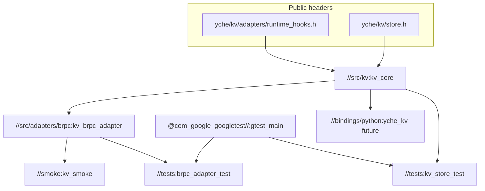

# Bazel C++17 KV 工程布局（src / tests / smoke + 对外 include + pybind 预留）

## 1. 设计目标（与你的要求对齐）

- **src / tests / smoke 三分**：源码与对外头文件在 `**src/`**；`**tests/`** 仅验证与测试桩；`**smoke/**` 仅短路径集成冒烟。
- **KV 实现**：核心逻辑自研（连接池、超时、错误码、Executor/WaitCallback 注入，对齐 [docs/design_kv.md](docs/design_kv.md)）；**实际读写 Redis** 用 **第三方库**（推荐 **hiredis**，C 接口、依赖面小；也可用 `redis-plus-plus` 等，Bazel 成本通常更高）。
- **对外 include**：单独树 `**src/include/`**（或仓库根 `include/`，二选一；下文采用 `**src/include`**，与实现同列便于一个 `cc_library` 导出接口）。
- **薄适配层**：与 brpc/bthread 相关的代码放在 `**src/adapters/brpc/`**，独立 `cc_library`，**不**污染 KV 核心头文件中的 brpc 类型；公共头文件只描述「运行时钩子」抽象（`std::function`）。
- **构建**：全程 **Bazel**，**C++17**（`.bazelrc` 或 `features` 固定）。
- **后续 pybind**：预留 `**bindings/python/`**（或 `python/`）目录与目标命名；模块只依赖 **KV 公共头文件 + 不含 brpc 的库**，避免在 Python 扩展里拉 brpc；若在 bthread 里调 KV，可在 Python 侧只暴露「同步阻塞式」或「默认 pthread 池」API。

---

## 2. 推荐目录树（供你 Review）

```text
yche-distsys-playground/
├── MODULE.bazel                 # bzlmod：brpc、hiredis；gtest 为 http_archive com_google_googletest + third_party/googletest.BUILD
├── .bazelrc                     # build --cxxopt=-std=c++17（及常用 warning）
├── docs/
│   └── design_kv.md
│
├── src/
│   ├── include/                 # 对外稳定 API（install / pybind / 其他 C++ 工程只依赖这里）
│   │   └── yche/
│   │       ├── kv/
│   │       │   ├── error.h           # 错误码枚举（与文档 CacheError 对齐，可命名 KvError）
│   │       │   ├── store.h           # 主接口：KvStore 或全局 Init/Get/Set（二选一，建议 class KvStore 可测）
│   │       │   └── types.h           # 可选：超时、选项结构体
│   │       └── kv/adapters/
│   │           └── runtime_hooks.h    # Executor / WaitCallback typedef + KvRuntime::Install 声明（无 brpc 符号）
│   │
│   ├── kv/                      # KV 核心实现（零 brpc）
│   │   ├── BUILD.bazel          # cc_library :kv_core，hdrs=public + 内部头，srcs=*.cc
│   │   ├── store.cpp            # 对外 API 实现，转发连接池 + executor/waiter
│   │   ├── conn_pool.cpp/.h     # 文档中的连接池（mutex/cv 仅在线程池任务内触碰）
│   │   └── backend/
│   │       ├── redis_backend.h  # 内部接口 IKvBackend
│   │       └── redis_hiredis.cpp # hiredis Get/Set/连接
│   │
│   └── adapters/
│       └── brpc/
│           ├── BUILD.bazel      # cc_library :kv_brpc_adapter，deps kv_core + @brpc
│           ├── brpc_runtime.cpp # pthread 线程池 + set_executor / set_waiter(bthread_yield)
│           └── brpc_runtime.h   # init_kv_for_brpc(ip, port, ...) 声明
│
├── tests/
│   ├── BUILD.bazel              # cc_test kv_store_test、brpc_adapter_test；py_test kv_store_py_test
│   ├── support/
│   │   ├── test_runtime.h       # 同步 executor + 同步 yield（文档 test_cache_adapter 语义）
│   │   └── test_runtime.cpp
│   ├── kv_store_test.cc         # gtest：//src/kv:kv_core + test_runtime，不链接 brpc
│   └── brpc_adapter_test.cc     # gtest：kv_brpc_adapter + stub bthread 内 get/set
│
├── smoke/
│   ├── BUILD.bazel
│   └── kv_smoke.cc              # 链接 kv_brpc_adapter，bthread 内读写，exit 码断言
│
└── bindings/                    # 后续 pybind（本阶段可只放 BUILD 占位或 README，不强制写代码）
    └── python/
        ├── BUILD.bazel          # py_extension 依赖 @pybind11_bazel + //src/kv:kv_core（不含 brpc）
        └── module.cpp           # PYBIND11_MODULE(yche_kv, m) 绑定 Get/Set
```

**说明：**

- `**src/include/yche/kv/`**：给外部用户、**smoke**、**tests**、未来 **Python** 看的契约；不要 `#include <bthread/...>`。
- `**src/kv/`**：唯一链接 **hiredis**（及可选 OpenSSL）的地方；单元测试可用 mock backend 或本地 Redis（CI 可用 testcontainers，计划中可写「可选」）。
- `**src/adapters/brpc/`**：唯一链接 **brpc** 的薄层；实现文档中的「独立线程池 + bthread_yield」语义（上游若无 `bthread::Executor` 则用 `std::thread` 池替代，已在下文原则中说明）。
- `**tests/`**：gtest；`support/test_runtime` 对应设计文档 单测适配；与 `**ut/`** 命名二选一，你已要求 **tests**，故不再使用 `ut/` 作为测试目录名。
- `**smoke/`**：最小可执行文件，验证「brpc 运行时 + KV」整条链路。
- `**bindings/python/`**：与 **src** 解耦；pybind 只依赖 `**//src/kv:kv_core`**（及 `runtime_hooks` 若要在 Python 里换 executor，可后续再加）。

---

## 3. Bazel 目标依赖关系（概念）



**GoogleTest**：C++ 测试依赖 **`@com_google_googletest//:gtest_main`**（非 `//external/googletest` BCR 模块），与 hiredis 一样由根模块 **`http_archive`** 提供。


---

## 4. 第三方 KV 访问

- **首选 [hiredis](https://github.com/redis/hiredis)**：在 `MODULE.bazel` 中 `http_archive` + 小型 `BUILD`（`cc_library` 导出 `hiredis`），或由 `rules_foreign_cc` 从 CMake 构建。
- **备选**：嵌入式 KV（RocksDB/LevelDB）若你希望 smoke 不依赖 Redis 进程——与「Redis 封装」文档略有偏差，可作为 **tests 用的 FakeInMemoryBackend** 放在 `tests/support` 或 `src/kv/backend`，不替代生产路径的 Redis。

---

## 5. 与 design_kv.md 的映射


| 文档概念                       | 落地位置                                                            |
| -------------------------- | --------------------------------------------------------------- |
| SafeCache / get / set / 注入 | `KvStore` + `runtime_hooks.h` + `src/kv/store.cpp`              |
| ConnPool + Redis           | `src/kv/conn_pool.`* + `backend/redis_hiredis.cpp`              |
| brpc 适配                    | `src/adapters/brpc/brpc_runtime.`*（pthread 池 + `bthread_yield`） |
| 单测适配                       | `tests/support/test_runtime.*`                                  |


---

## 6. 风险与验收（不变更原则）

- brpc 的 Bazel 集成仍以选定版本为准；protobuf 版本冲突用 `single_version_override`。
- **Bazel 9 + GoogleTest**：不宜直接 `bazel_dep(googletest)`（BCR 包内 `BUILD.bazel` 仍用原生 `cc_*`）；本仓库用 **`http_archive` + `third_party/googletest.BUILD`**。
- **验收**：`bazel test //tests/...`、`bazel run //smoke:kv_smoke`；有 Redis 时跑集成，无 Redis 时 tests 可走 in-memory fake（若实现 fake）。

---

## 7. 下一步（你 Review 目录后）

1. 确认 **public 命名空间**（`yche::kv`）与 **类 vs 单例**（建议 `KvStore` 实例便于测试与 pybind）。
2. 确认 **Redis 是否为 smoke 必需**（是则 CI 文档注明端口；否则 smoke 先用 in-memory backend 开关）。
3. 再进入实现阶段：按上表创建 `BUILD`、`kv_core`、adapter、tests、smoke，最后补 `bindings/python` 占位。

